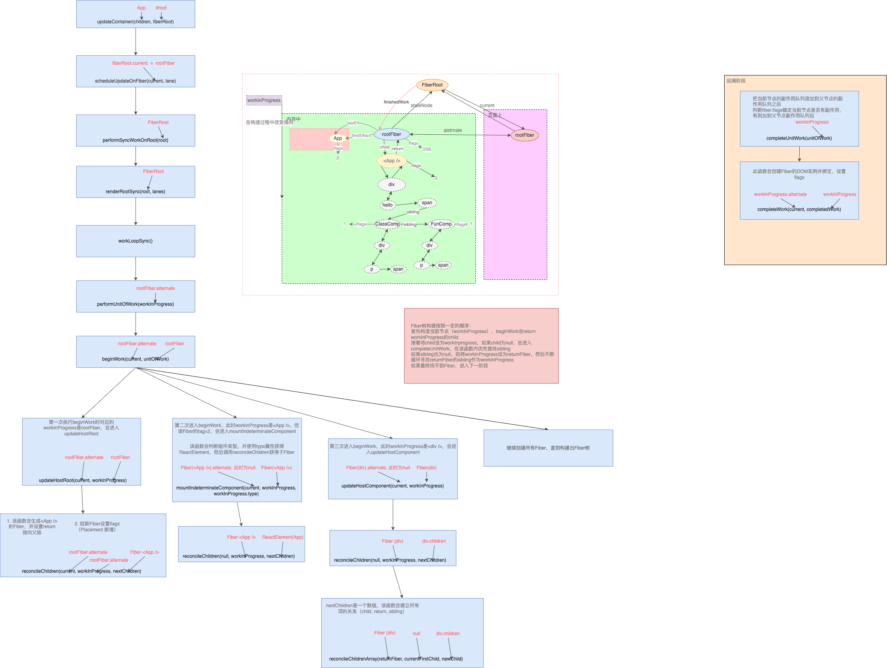

## fiber树构造-前置知识
### 全局变量
在React运行时, `ReactFiberWorkLoop.js`闭包中的全局变量会随着`fiber`树构造循环的进行而变化, 现在查看其中重要的全局变量
```js
// 当前React的执行栈(执行上下文)
let executionContext: ExecutionContext = NoContext;

// 当前root节点
let workInProgressRoot: FiberRoot | null = null;
// 正在处理中的fiber节点
let workInProgress: Fiber | null = null;
// 正在渲染的车道(复数)
let workInProgressRootRenderLanes: Lanes = NoLanes;

// 包含所有子节点的优先级, 是workInProgressRootRenderLanes的超集
// 大多数情况下: 在工作循环整体层面会使用workInProgressRootRenderLanes, 在begin/complete阶段层面会使用 subtreeRenderLanes
let subtreeRenderLanes: Lanes = NoLanes;
// 一个栈结构: 专门存储当前节点的 subtreeRenderLanes
const subtreeRenderLanesCursor: StackCursor<Lanes> = createCursor(NoLanes);

// fiber构造完后, root节点的状态: completed, errored, suspended等
let workInProgressRootExitStatus: RootExitStatus = RootIncomplete;
// 重大错误
let workInProgressRootFatalError: mixed = null;
// 整个render期间所使用到的所有lanes
let workInProgressRootIncludedLanes: Lanes = NoLanes;
// 在render期间被跳过(由于优先级不够)的lanes: 只包括未处理的updates, 不包括被复用的fiber节点
let workInProgressRootSkippedLanes: Lanes = NoLanes;
// 在render期间被修改过的lanes
let workInProgressRootUpdatedLanes: Lanes = NoLanes;

// 防止无限循环和嵌套更新
const NESTED_UPDATE_LIMIT = 50;
let nestedUpdateCount: number = 0;
let rootWithNestedUpdates: FiberRoot | null = null;

const NESTED_PASSIVE_UPDATE_LIMIT = 50;
let nestedPassiveUpdateCount: number = 0;

// 发起更新的时间
let currentEventTime: number = NoTimestamp;
let currentEventWipLanes: Lanes = NoLanes;
let currentEventPendingLanes: Lanes = NoLanes;
```

### 执行上下文
在全局变量中有`executionContext`, 代表渲染期间的执行栈(或叫做执行上下文), 它也是一个二进制表示的变量, 通过位运算进行操作. 在源码中一共定义了 8 种执行栈:
```js
type ExecutionContext = number;
export const NoContext = /*             */ 0b0000000;
const BatchedContext = /*               */ 0b0000001;
const EventContext = /*                 */ 0b0000010;
const DiscreteEventContext = /*         */ 0b0000100;
const LegacyUnbatchedContext = /*       */ 0b0001000;
const RenderContext = /*                */ 0b0010000;
const CommitContext = /*                */ 0b0100000;
```

事实上正是`executionContext`在操控`reconciler 运作流程`
```js
export function scheduleUpdateOnFiber(
  fiber: Fiber,
  lane: Lane,
  eventTime: number,
) {
  if (lane === SyncLane) {
    // legacy或blocking模式
    if (
      (executionContext & LegacyUnbatchedContext) !== NoContext &&
      (executionContext & (RenderContext | CommitContext)) === NoContext
    ) {
      performSyncWorkOnRoot(root);
    } else {
      // 后续的更新
      // 进入第2阶段, 注册调度任务
      ensureRootIsScheduled(root, eventTime);
      if (executionContext === NoContext) {
        // 如果执行上下文为空, 会取消调度任务, 手动执行回调
        // 进入第3阶段, 进行fiber树构造
        flushSyncCallbackQueue();
      }
    }
  } else {
    // concurrent模式
    // 无论是否初次更新, 都正常进入第2阶段, 注册调度任务
    ensureRootIsScheduled(root, eventTime);
  }
}
```
在 `render` 过程中, 每一个阶段都会改变`executionContext`(render 之前, 会设置`executionContext |= RenderContext`; commit 之前, 会设置`executionContext |= CommitContext`), 假设在`render`过程中再次发起更新(如在`UNSAFE_componentWillReceiveProps`生命周期中调用`setState`)则可通过`executionContext`来判断当前的`render状态`.

### 双缓冲技术(double buffering)
`fiber`树的构造过程, 就是把`ReactElement`转换成`fiber`树的过程. 在这个过程中, 内存里会同时存在 2 棵`fiber树`:
- 其一: 代表当前界面的`fiber`树(已经被展示出来, 挂载到`fiberRoot.current`上). 如果是初次构造(初始化渲染), 页面还没有渲染, 此时界面对应的 `fiber` 树为空(`fiberRoot.current = null`).
- 其二: 正在构造的`fiber`树(即将展示出来, 挂载到`HostRootFiber.alternate`上, 正在构造的节点称为`workInProgress`). 当构造完成之后, 重新渲染页面, 最后切换`fiberRoot.current = workInProgress`, 使得`fiberRoot.current`重新指向代表当前界面的fiber树.
  
用图来表述`double buffering`的概念如下:
1. 构造过程中, `fiberRoot.current`指向当前界面对应的`fiber`树.
   
2. 构造完成并渲染, 切换`fiberRoot.current`指针, 使其继续指向当前界面对应的`fiber树`(原来代表界面的 fiber 树, 变成了内存中).
   


### 优先级
在整个`react-reconciler`包中, `Lane`的应用可以分为 3 个方面:

#### update优先级(update.lane)
`update`对象是一个环形链表. 对于单个`update`对象来讲, `update.lane`代表它的优先级, 称之为`update优先级`
观察其构造函数,其优先级是由外界传入.
```js
export function createUpdate(eventTime: number, lane: Lane): Update<*> {
  const update: Update<*> = {
    eventTime,
    lane,
    tag: UpdateState,
    payload: null,
    callback: null,
    next: null,
  };
  return update;
}
```
在`React`体系中, 有 2 种情况会创建`update`对象:
1. 应用初始化: 在`react-reconciler`包中的`updateContainer`函数中
   ```js
    export function updateContainer(
      element: ReactNodeList,
      container: OpaqueRoot,
      parentComponent: ?React$Component<any, any>,
      callback: ?Function,
    ): Lane {
      const current = container.current;
      const eventTime = requestEventTime();
      const lane = requestUpdateLane(current); // 根据当前时间, 创建一个update优先级
      const update = createUpdate(eventTime, lane); // lane被用于创建update对象
      update.payload = { element };
      enqueueUpdate(current, update);
      scheduleUpdateOnFiber(current, lane, eventTime);
      return lane;
    }
   ```
2. 发起组件更新: 假设在 `class` 组件中调用`setState`
   ```js
    const classComponentUpdater = {
      isMounted,
      enqueueSetState(inst, payload, callback) {
        const fiber = getInstance(inst);
        const eventTime = requestEventTime(); // 根据当前时间, 创建一个update优先级
        const lane = requestUpdateLane(fiber); // lane被用于创建update对象
        const update = createUpdate(eventTime, lane);
        update.payload = payload;
        enqueueUpdate(fiber, update);
        scheduleUpdateOnFiber(fiber, lane, eventTime);
      },
    };
   ```
可以看到, 无论是应用初始化或者发起组件更新, 创建`update.lane`的逻辑都是一样的, 都是根据当前时间, 创建一个 `update 优先级`.

```js
export function requestUpdateLane(fiber: Fiber): Lane {
  // Special cases
  const mode = fiber.mode;
  if ((mode & BlockingMode) === NoMode) {
    // legacy 模式
    return (SyncLane: Lane);
  } else if ((mode & ConcurrentMode) === NoMode) {
    // blocking模式
    return getCurrentPriorityLevel() === ImmediateSchedulerPriority
      ? (SyncLane: Lane)
      : (SyncBatchedLane: Lane);
  }
  // concurrent模式
  if (currentEventWipLanes === NoLanes) {
    currentEventWipLanes = workInProgressRootIncludedLanes;
  }
  const isTransition = requestCurrentTransition() !== NoTransition;
  if (isTransition) {
    // 特殊情况, 处于suspense过程中
    if (currentEventPendingLanes !== NoLanes) {
      currentEventPendingLanes =
        mostRecentlyUpdatedRoot !== null
          ? mostRecentlyUpdatedRoot.pendingLanes
          : NoLanes;
    }
    return findTransitionLane(currentEventWipLanes, currentEventPendingLanes);
  }
  // 正常情况, 获取调度优先级
  const schedulerPriority = getCurrentPriorityLevel();
  let lane;
  if (
    (executionContext & DiscreteEventContext) !== NoContext &&
    schedulerPriority === UserBlockingSchedulerPriority
  ) {
    // executionContext 存在输入事件. 且调度优先级是用户阻塞性质
    lane = findUpdateLane(InputDiscreteLanePriority, currentEventWipLanes);
  } else {
    // 调度优先级转换为车道模型
    const schedulerLanePriority = schedulerPriorityToLanePriority(
      schedulerPriority,
    );
    lane = findUpdateLane(schedulerLanePriority, currentEventWipLanes);
  }
  return lane;
}
```
可以看到`requestUpdateLane`的作用是返回一个合适的 `update 优先级`.
1. `legacy` 模式: 返回`SyncLane`
2. `blocking` 模式: 返回`SyncLane`
3. `concurrent` 模式
   - 正常情况下, 根据当前的`调度优先级`来生成一个`lane`.
   - 特殊情况下(处于 `suspense` 过程中), 会优先选择`TransitionLanes`通道中的空闲通道(如果所有`TransitionLanes`通道都被占用, 就取最高优先级.).

最后通过`scheduleUpdateOnFiber(current, lane, eventTime);`函数, 把`update.lane`正式带入到了`输入阶段`.
`scheduleUpdateOnFiber`是输入阶段的必经函数, 此处以`update.lane`的视角分析:
```js
export function scheduleUpdateOnFiber(
  fiber: Fiber,
  lane: Lane,
  eventTime: number,
) {
  if (lane === SyncLane) {
    // legacy或blocking模式
    if (
      (executionContext & LegacyUnbatchedContext) !== NoContext &&
      (executionContext & (RenderContext | CommitContext)) === NoContext
    ) {
      performSyncWorkOnRoot(root);
    } else {
      ensureRootIsScheduled(root, eventTime); // 注册回调任务
      if (executionContext === NoContext) {
        flushSyncCallbackQueue(); // 取消schedule调度 ,主动刷新回调队列,
      }
    }
  } else {
    // concurrent模式
    ensureRootIsScheduled(root, eventTime);
  }
}
```
当`lane === SyncLane`也就是 `legacy` 或 `blocking` 模式中, 注册完回调任务之后(`ensureRootIsScheduled(root, eventTime)`), 如果执行上下文为空, 会取消 `schedule` 调度, 主动刷新回调队列`flushSyncCallbackQueue()`.
这里包含了一个热点问题(`setState到底是同步还是异步`)的标准答案:
- 如果逻辑进入`flushSyncCallbackQueue(executionContext === NoContext)`, 则会主动取消调度, 并刷新回调, 立即进入`fiber`树构造过程. 当执行`setState`下一行代码时, `fiber`树已经重新渲染了, 故`setState`体现为同步.
- 正常情况下, 不会取消`schedule`调度. 由于`schedule`调度是通过`MessageChannel`触发(宏任务), 故体现为异步


## fiber 树构造(初次创建)

在控制台查看当前`fiber`树：
```js
document.getElementById('root')._reactRootContainer._internalRoot.current
```

`fiber`树初次构建发生在`updateContainer`函数
```js
export function updateContainer(
  element: ReactNodeList,
  container: OpaqueRoot,
  parentComponent: ?React$Component<any, any>,
  callback: ?Function,
): Lane {
  // 获取当前时间戳
  const current = container.current;
  const eventTime = requestEventTime();
  // 1. 创建一个优先级变量(车道模型)
  const lane = requestUpdateLane(current);

  // 2. 根据车道优先级, 创建update对象, 并加入fiber.updateQueue.pending队列
  const update = createUpdate(eventTime, lane);
  update.payload = { element };
  callback = callback === undefined ? null : callback;
  if (callback !== null) {
    update.callback = callback;
  }
  enqueueUpdate(current, update);

  // 3. 进入reconciler运作流程中的`输入`环节
  scheduleUpdateOnFiber(current, lane, eventTime);
  return lane;
}
```

### 构造阶段
```js
// ...省略部分代码
export function scheduleUpdateOnFiber(
  fiber: Fiber,
  lane: Lane,
  eventTime: number,
) {
  // 标记优先级
  const root = markUpdateLaneFromFiberToRoot(fiber, lane);
  if (lane === SyncLane) {
    if (
      (executionContext & LegacyUnbatchedContext) !== NoContext &&
      (executionContext & (RenderContext | CommitContext)) === NoContext
    ) {
      // 首次渲染, 直接进行`fiber构造`
      performSyncWorkOnRoot(root);
    }
    // ...
  }
}
```
可以看到, 在`Legacy`模式下且首次渲染时, 有 2 个函数`markUpdateLaneFromFiberToRoot`和`performSyncWorkOnRoot`.
其中`markUpdateLaneFromFiberToRoot(fiber, lane)`函数在`fiber`树构造(对比更新)中才会发挥作用, 因为在初次创建时并没有与当前页面所对应的`fiber`树, 所以核心代码并没有执行, 最后直接返回了`FiberRoot`对象.
`performSyncWorkOnRoot`看起来源码很多, 初次创建中真正用到的就 2 个函数:
```js
function performSyncWorkOnRoot(root) {
  let lanes;
  let exitStatus;
  if (
    root === workInProgressRoot &&
    includesSomeLane(root.expiredLanes, workInProgressRootRenderLanes)
  ) {
    // 初次构造时(因为root=fiberRoot, workInProgressRoot=null), 所以不会进入
  } else {
    // 1. 获取本次render的优先级, 初次构造返回 NoLanes
    lanes = getNextLanes(root, NoLanes);
    // 2. 从root节点开始, 至上而下更新
    exitStatus = renderRootSync(root, lanes);
  }

  // 将最新的fiber树挂载到root.finishedWork节点上
  const finishedWork: Fiber = (root.current.alternate: any);
  root.finishedWork = finishedWork;
  root.finishedLanes = lanes;
  // 进入commit阶段
  commitRoot(root);

  // ...后面的内容本节不讨论
}
```
```js
function renderRootSync(root: FiberRoot, lanes: Lanes) {
  const prevExecutionContext = executionContext;
  executionContext |= RenderContext;
  // 如果fiberRoot变动, 或者update.lane变动, 都会刷新栈帧, 丢弃上一次渲染进度
  if (workInProgressRoot !== root || workInProgressRootRenderLanes !== lanes) {
    // 刷新栈帧, legacy模式下都会进入
    prepareFreshStack(root, lanes);
  }
  do {
    try {
      workLoopSync();
      break;
    } catch (thrownValue) {
      handleError(root, thrownValue);
    }
  } while (true);
  executionContext = prevExecutionContext;
  // 重置全局变量, 表明render结束
  workInProgressRoot = null;
  workInProgressRootRenderLanes = NoLanes;
  return workInProgressRootExitStatus;
}
```

在`renderRootSync`中, 在执行`fiber`树构造前(`workLoopSync`)会先刷新栈帧`prepareFreshStack`.在这里创建了`HostRootFiber.alternate`, 重置全局变量`workInProgress`和`workInProgressRoot`等.

### 循环构造
`legacy`模式下的`workLoopSync`
```js
function workLoopSync() {
  while (workInProgress !== null) {
    performUnitOfWork(workInProgress);
  }
}
```

```js
function performUnitOfWork(unitOfWork: Fiber): void {
  // unitOfWork就是被传入的workInProgress
  const current = unitOfWork.alternate;
  let next;
  next = beginWork(current, unitOfWork, subtreeRenderLanes);
  unitOfWork.memoizedProps = unitOfWork.pendingProps;
  if (next === null) {
    // 如果没有派生出新的节点, 则进入completeWork阶段, 传入的是当前unitOfWork
    completeUnitOfWork(unitOfWork);
  } else {
    workInProgress = next;
  }
}
```

其中有 2 个重要的变量`workInProgress`和`current`
- `workInProgress`和`current`都视为指针
- `workInProgress`指向当前正在构造的`fiber`节点
- `current = workInProgress.alternate`(即`fiber.alternate`), 指向当前页面正在使用的`fiber`节点. 初次构造时, 页面还未渲染, 此时`current = null`.

在深度优先遍历中, 每个`fiber`节点都会经历 2 个阶段
1. 探寻阶段 `beginWork`
2. 回溯阶段 `completeWork`

这 2 个阶段共同完成了每一个`fiber`节点的创建, 所有`fiber`节点则构成了`fiber`树

### 探寻阶段 beginWork
`beginWork(current, unitOfWork, subtreeRenderLanes)`针对所有的 `Fiber` 类型, 其中的每一个 `case` 处理一种 `Fiber` 类型. `updateXXX`函数(如: `updateHostRoot, updateClassComponent` 等)的主要逻辑
1. 根据 `ReactElement`对象创建所有的`fiber`节点, 最终构造出`fiber`树形结构(设置`return`和`sibling`指针)
2. 设置`fiber.flags`(二进制形式变量, 用来标记 `fiber`节点 的`增,删,改`状态, 等待`completeWork`阶段处理)
3. 设置`fiber.stateNode`局部状态(如`Class`类型节点: `fiber.stateNode=new Class()`)

```js
function beginWork(
  current: Fiber | null,
  workInProgress: Fiber,
  renderLanes: Lanes,
): Fiber | null {
  const updateLanes = workInProgress.lanes;
  if (current !== null) {
    // update逻辑, 首次render不会进入
  } else {
    didReceiveUpdate = false;
  }
  // 1. 设置workInProgress优先级为NoLanes(最高优先级)
  workInProgress.lanes = NoLanes;
  // 2. 根据workInProgress节点的类型, 用不同的方法派生出子节点
  switch (
    workInProgress.tag // 只保留了本例使用到的case
  ) {
    case ClassComponent: {
      const Component = workInProgress.type;
      const unresolvedProps = workInProgress.pendingProps;
      const resolvedProps =
        workInProgress.elementType === Component
          ? unresolvedProps
          : resolveDefaultProps(Component, unresolvedProps);
      return updateClassComponent(
        current,
        workInProgress,
        Component,
        resolvedProps,
        renderLanes,
      );
    }
    case HostRoot:
      return updateHostRoot(current, workInProgress, renderLanes);
    case HostComponent:
      return updateHostComponent(current, workInProgress, renderLanes);
    case HostText:
      return updateHostText(current, workInProgress);
    case Fragment:
      return updateFragment(current, workInProgress, renderLanes);
  }
}
```
`updateXXX`函数(如: `updateHostRoot, updateClassComponent` 等)虽然 `case` 较多, 但是主要逻辑可以概括为 3 个步骤:
1. 根据`fiber.pendingProps, fiber.updateQueue`等输入数据状态, 计算`fiber.memoizedState`作为输出状态
2. 获取下级`ReactElement`对象
  1. `class` 类型的 `fiber` 节点
     - 构建`React.Component`实例
     - 把新实例挂载到`fiber.stateNode`上
     - 执行`render`之前的生命周期函数
     - 执行`render`方法, 获取下级`reactElement`
     - 根据实际情况, 设置`fiber.flags`
  2. `function` 类型的 `fiber` 节点
     - 执行 `function`, 获取下级`reactElement`
     - 根据实际情况, 设置`fiber.flags`
  3. `HostComponent` 类型(如: `div, span, button` 等)的 `fiber` 节点
     - `pendingProps.children`作为下级`reactElement`
     - 如果下级节点是文本节点,则设置下级节点为 `null`. 准备进入`completeUnitOfWork`阶段
     - 根据实际情况, 设置`fiber.flags`
  4. 其他类型...
3. 根据`ReactElement`对象, 调用`reconcileChildren`生成`Fiber`子节点(只生成次级子节点)
  - 根据实际情况, 设置`fiber.flags`

不同的`updateXXX`函数处理的`fiber`节点类型不同, 总的目的是为了向下生成子节点. 在这个过程中把一些需要持久化的数据挂载到`fiber`节点上(如`fiber.stateNode,fiber.memoizedState`等); 把`fiber`节点的特殊操作设置到`fiber.flags`(如:`节点ref`,`class组件的生命周期`,`function组件的hook`,`节点删除`等)

`fiber`树的根节点是`HostRootFiber`节点, 所以第一次进入`beginWork`会调用`updateHostRoot(current, workInProgress, renderLanes)`
```js
function updateHostRoot(current, workInProgress, renderLanes) {
  // 1. 状态计算, 更新整合到 workInProgress.memoizedState中来
  const updateQueue = workInProgress.updateQueue;
  const nextProps = workInProgress.pendingProps;
  const prevState = workInProgress.memoizedState;
  const prevChildren = prevState !== null ? prevState.element : null;
  cloneUpdateQueue(current, workInProgress);
  // 遍历updateQueue.shared.pending, 提取有足够优先级的update对象, 计算出最终的状态 workInProgress.memoizedState
  processUpdateQueue(workInProgress, nextProps, null, renderLanes);
  const nextState = workInProgress.memoizedState;
  // 2. 获取下级`ReactElement`对象
  const nextChildren = nextState.element;
  const root: FiberRoot = workInProgress.stateNode;
  if (root.hydrate && enterHydrationState(workInProgress)) {
    // ...服务端渲染相关, 此处省略
  } else {
    // 3. 根据`ReactElement`对象, 调用`reconcileChildren`生成`Fiber`子节点(只生成`次级子节点`)
    reconcileChildren(current, workInProgress, nextChildren, renderLanes);
  }
  return workInProgress.child;
}
```

普通 `DOM` 标签类型的节点(如`div,span,p`),会进入`updateHostComponent`:
```js
function updateHostComponent(
  current: Fiber | null,
  workInProgress: Fiber,
  renderLanes: Lanes,
) {
  // 1. 状态计算, 由于HostComponent是无状态组件, 所以只需要收集 nextProps即可, 它没有 memoizedState
  const type = workInProgress.type;
  const nextProps = workInProgress.pendingProps;
  const prevProps = current !== null ? current.memoizedProps : null;
  // 2. 获取下级`ReactElement`对象
  let nextChildren = nextProps.children;
  const isDirectTextChild = shouldSetTextContent(type, nextProps);

  if (isDirectTextChild) {
    // 如果子节点只有一个文本节点, 不用再创建一个HostText类型的fiber
    nextChildren = null;
  } else if (prevProps !== null && shouldSetTextContent(type, prevProps)) {
    // 特殊操作需要设置fiber.flags
    workInProgress.flags |= ContentReset;
  }
  // 特殊操作需要设置fiber.flags
  markRef(current, workInProgress);
  // 3. 根据`ReactElement`对象, 调用`reconcileChildren`生成`Fiber`子节点(只生成`次级子节点`)
  reconcileChildren(current, workInProgress, nextChildren, renderLanes);
  return workInProgress.child;
}
```

#### 流程图


### 回溯阶段 completeWork
`completeUnitOfWork(unitOfWork)`, 处理 `beginWork` 阶段已经创建出来的 `fiber` 节点, 核心逻辑:
1. 调用`completeWork`
   - 给`fiber`节点(`tag=HostComponent, HostText`)创建 `DOM` 实例, 设置`fiber.stateNode`局部状态(如`tag=HostComponent`, `HostText`节点: `fiber.stateNode` 指向这个 `DOM` 实例).
   - 为 `DOM` 节点设置属性, 绑定事件(这里先说明有这个步骤, 详细的事件处理流程, 在合成事件原理中详细说明).
   - 设置`fiber.flags`标记
2. 把当前 `fiber` 对象的副作用队列(`firstEffect`和`lastEffect`)添加到父节点的副作用队列之后, 更新父节点的`firstEffect`和`lastEffect`指针.
3. 识别`beginWork`阶段设置的`fiber.flags`, 判断当前 `fiber` 是否有副作用(`增,删,改`), 如果有, 需要将当前 `fiber` 加入到父节点的`effects`队列, 等待`commit`阶段处理

```js
function completeUnitOfWork(unitOfWork: Fiber): void {
  let completedWork = unitOfWork;
  // 外层循环控制并移动指针(`workInProgress`,`completedWork`等)
  do {
    const current = completedWork.alternate;
    const returnFiber = completedWork.return;
    if ((completedWork.flags & Incomplete) === NoFlags) {
      let next;
      // 1. 处理Fiber节点, 会调用渲染器(调用react-dom包, 关联Fiber节点和dom对象, 绑定事件等)
      next = completeWork(current, completedWork, subtreeRenderLanes); // 处理单个节点
      if (next !== null) {
        // 如果派生出其他的子节点, 则回到`beginWork`阶段进行处理
        workInProgress = next;
        return;
      }
      // 重置子节点的优先级
      resetChildLanes(completedWork);
      if (
        returnFiber !== null &&
        (returnFiber.flags & Incomplete) === NoFlags
      ) {
        // 2. 收集当前Fiber节点以及其子树的副作用effects
        // 2.1 把子节点的副作用队列添加到父节点上
        if (returnFiber.firstEffect === null) {
          returnFiber.firstEffect = completedWork.firstEffect;
        }
        if (completedWork.lastEffect !== null) {
          if (returnFiber.lastEffect !== null) {
            returnFiber.lastEffect.nextEffect = completedWork.firstEffect;
          }
          returnFiber.lastEffect = completedWork.lastEffect;
        }
        // 2.2 如果当前fiber节点有副作用, 将其添加到子节点的副作用队列之后.
        const flags = completedWork.flags;
        if (flags > PerformedWork) {
          // PerformedWork是提供给 React DevTools读取的, 所以略过PerformedWork
          if (returnFiber.lastEffect !== null) {
            returnFiber.lastEffect.nextEffect = completedWork;
          } else {
            returnFiber.firstEffect = completedWork;
          }
          returnFiber.lastEffect = completedWork;
        }
      }
    } else {
      // 异常处理, 本节不讨论
    }

    const siblingFiber = completedWork.sibling;
    if (siblingFiber !== null) {
      // 如果有兄弟节点, 返回之后再次进入`beginWork`阶段
      workInProgress = siblingFiber;
      return;
    }
    // 移动指针, 指向下一个节点
    completedWork = returnFiber;
    workInProgress = completedWork;
  } while (completedWork !== null);
  // 已回溯到根节点, 设置workInProgressRootExitStatus = RootCompleted
  if (workInProgressRootExitStatus === RootIncomplete) {
    workInProgressRootExitStatus = RootCompleted;
  }
}
```
接下来分析`fiber`处理函数`completeWork`
```js
function completeWork(
  current: Fiber | null,
  workInProgress: Fiber,
  renderLanes: Lanes,
): Fiber | null {
  const newProps = workInProgress.pendingProps;
  switch (workInProgress.tag) {
    case ClassComponent: {
      // Class类型不做处理
      return null;
    }
    case HostRoot: {
      const fiberRoot = (workInProgress.stateNode: FiberRoot);
      if (fiberRoot.pendingContext) {
        fiberRoot.context = fiberRoot.pendingContext;
        fiberRoot.pendingContext = null;
      }
      if (current === null || current.child === null) {
         // 设置fiber.flags标记
         workInProgress.flags |= Snapshot;
      }
      return null;
    }
    case HostComponent: {
      popHostContext(workInProgress);
      const rootContainerInstance = getRootHostContainer();
      const type = workInProgress.type;
      if (current !== null && workInProgress.stateNode != null) {
        // update逻辑, 初次render不会进入
      } else {
        const currentHostContext = getHostContext();
        // 1. 创建DOM对象
        const instance = createInstance(
          type,
          newProps,
          rootContainerInstance,
          currentHostContext,
          workInProgress,
        );
        // 2. 把子树中的DOM对象append到本节点的DOM对象之后
        appendAllChildren(instance, workInProgress, false, false);
        // 设置stateNode属性, 指向DOM对象
        workInProgress.stateNode = instance;
        if (
          // 3. 设置DOM对象的属性, 绑定事件等
          finalizeInitialChildren(
            instance,
            type,
            newProps,
            rootContainerInstance,
            currentHostContext,
          )
        ) {
          // 设置fiber.flags标记(Update)
          markUpdate(workInProgress);
        }
        if (workInProgress.ref !== null) {
          // 设置fiber.flags标记(Ref)
          markRef(workInProgress);
        }
        return null;
    }
  }
}
```


