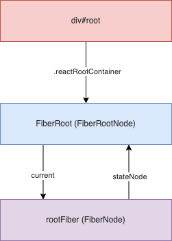

## 预定义对象

### FiberRoot  RootFiber


[React FiberRoot和RootFiber源码](https://blog.csdn.net/qq_39583550/article/details/125893250)

### ReactElement
所有采用`jsx`语法书写的节点, 都会被编译器转换, 最终会以`React.createElement(...)`的方式, 创建出来一个与之对应的`ReactElement`对象.
`ReactElement`对象的数据结构如下:
```js
export type ReactElement = {|
  // 用于辨别ReactElement对象
  $$typeof: any,

  // 内部属性
  type: any, // 表明其种类
  key: any,
  ref: any,
  props: any,

  // ReactFiber 记录创建本对象的Fiber节点, 还未与Fiber树关联之前, 该属性为null
  _owner: any,

  // __DEV__ dev环境下的一些额外信息, 如文件路径, 文件名, 行列信息等
  _store: {validated: boolean, ...},
  _self: React$Element<any>,
  _shadowChildren: any,
  _source: Source,
|};
```

### Fiber 对象
```js
// 一个Fiber对象代表一个即将渲染或者已经渲染的组件(ReactElement), 一个组件可能对应两个fiber(current和WorkInProgress)
export type Fiber = {|
  tag: WorkTag,
  key: null | string,
  elementType: any,
  type: any,
  stateNode: any,
  return: Fiber | null,
  child: Fiber | null,
  sibling: Fiber | null,
  index: number,
  ref:
    | null
    | (((handle: mixed) => void) & { _stringRef: ?string, ... })
    | RefObject,
  pendingProps: any, // 从`ReactElement`对象传入的 props. 用于和`fiber.memoizedProps`比较可以得出属性是否变动
  memoizedProps: any, // 上一次生成子节点时用到的属性, 生成子节点之后保持在内存中
  updateQueue: mixed, // 存储state更新的队列, 当前节点的state改动之后, 都会创建一个update对象添加到这个队列中.
  memoizedState: any, // 用于输出的state, 最终渲染所使用的state
  dependencies: Dependencies | null, // 该fiber节点所依赖的(contexts, events)等
  mode: TypeOfMode, // 二进制位Bitfield,继承至父节点,影响本fiber节点及其子树中所有节点. 与react应用的运行模式有关(有ConcurrentMode, BlockingMode, NoMode等选项).

  // Effect 副作用相关
  flags: Flags, // 标志位
  subtreeFlags: Flags, //替代16.x版本中的 firstEffect, nextEffect. 当设置了 enableNewReconciler=true才会启用
  deletions: Array<Fiber> | null, // 存储将要被删除的子节点. 当设置了 enableNewReconciler=true才会启用

  nextEffect: Fiber | null, // 单向链表, 指向下一个有副作用的fiber节点
  firstEffect: Fiber | null, // 指向副作用链表中的第一个fiber节点
  lastEffect: Fiber | null, // 指向副作用链表中的最后一个fiber节点

  // 优先级相关
  lanes: Lanes, // 本fiber节点的优先级
  childLanes: Lanes, // 子节点的优先级
  alternate: Fiber | null, // 指向内存中的另一个fiber, 每个被更新过fiber节点在内存中都是成对出现(current和workInProgress)

  // 性能统计相关(开启enableProfilerTimer后才会统计)
  // react-dev-tool会根据这些时间统计来评估性能
  actualDuration?: number, // 本次更新过程, 本节点以及子树所消耗的总时间
  actualStartTime?: number, // 标记本fiber节点开始构建的时间
  selfBaseDuration?: number, // 用于最近一次生成本fiber节点所消耗的时间
  treeBaseDuration?: number, // 生成子树所消耗的时间的总和
|};
```

属性解释:

- `fiber.tag`: 表示 fiber 类型, 根据`ReactElement`组件的 type 进行生成, 在 react 内部共定义了[25 种 tag](https://github.com/facebook/react/blob/v17.0.2/packages/react-reconciler/src/ReactWorkTags.js#L10-L35).
- `fiber.key`: 和`ReactElement`组件的 key 一致.
- `fiber.elementType`: 一般来讲和`ReactElement`组件的 type 一致
- `fiber.type`: 一般来讲和`fiber.elementType`一致. 一些特殊情形下, 比如在开发环境下为了兼容热更新(`HotReloading`), 会对`function, class, ForwardRef`类型的`ReactElement`做一定的处理, 这种情况会区别于`fiber.elementType`, 具体赋值关系可以查看[源文件](https://github.com/facebook/react/blob/v17.0.2/packages/react-reconciler/src/ReactFiber.old.js#L571-L574).
- `fiber.stateNode`: 与`fiber`关联的局部状态节点(比如: `HostComponent`类型指向与`fiber`节点对应的 dom 节点; 根节点`fiber.stateNode`指向的是`FiberRoot`; class 类型节点其`stateNode`指向的是 class 实例).
- `fiber.return`: 指向父节点.
- `fiber.child`: 指向第一个子节点.
- `fiber.sibling`: 指向下一个兄弟节点.
- `fiber.index`: fiber 在兄弟节点中的索引, 如果是单节点默认为 0.
- `fiber.ref`: 指向在`ReactElement`组件上设置的 ref(`string`类型的`ref`除外, 这种类型的`ref`已经不推荐使用, `reconciler`阶段会`将string`类型的`ref`转换成一个`function`类型).
- `fiber.pendingProps`: 输入属性, 从`ReactElement`对象传入的 props. 用于和`fiber.memoizedProps`比较可以得出属性是否变动.
- `fiber.memoizedProps`: 上一次生成子节点时用到的属性, 生成子节点之后保持在内存中. 向下生成子节点之前叫做`pendingProps`, 生成子节点之后会把`pendingProps`赋值给`memoizedProps`用于下一次比较.`pendingProps`和`memoizedProps`比较可以得出属性是否变动.
- `fiber.updateQueue`: 存储`update更新对象`的队列, 每一次发起更新, 都需要在该队列上创建一个`update对象`.
- `fiber.memoizedState`: 上一次生成子节点之后保持在内存中的局部状态.
- `fiber.dependencies`: 该 fiber 节点所依赖的(contexts, events)等, 在`context`机制章节详细说明.
- `fiber.mode`: 二进制位 Bitfield,继承至父节点,影响本 fiber 节点及其子树中所有节点. 与 react 应用的运行模式有关(有 ConcurrentMode, BlockingMode, NoMode 等选项).
- `fiber.flags`: 标志位, 副作用标记(在 16.x 版本中叫做`effectTag`, 相应[pr](https://github.com/facebook/react/pull/19755)), 在[`ReactFiberFlags.js`](https://github.com/facebook/react/blob/v17.0.2/packages/react-reconciler/src/ReactFiberFlags.js#L10-L41)中定义了所有的标志位. `reconciler`阶段会将所有拥有`flags`标记的节点添加到副作用链表中, 等待 commit 阶段的处理.
- `fiber.subtreeFlags`: 替代 16.x 版本中的 firstEffect, nextEffect. 默认未开启, 当设置了[enableNewReconciler=true](https://github.com/facebook/react/blob/v17.0.2/packages/shared/ReactFeatureFlags.js#L93) 才会启用, 本系列只跟踪稳定版的代码, 未来版本不会深入解读, [使用示例见源码](https://github.com/facebook/react/blob/v17.0.2/packages/react-reconciler/src/ReactFiberCompleteWork.new.js#L690-L714).
- `fiber.deletions`: 存储将要被删除的子节点. 默认未开启, 当设置了[enableNewReconciler=true](https://github.com/facebook/react/blob/v17.0.2/packages/shared/ReactFeatureFlags.js#L93) 才会启用, 本系列只跟踪稳定版的代码, 未来版本不会深入解读, [使用示例见源码](https://github.com/facebook/react/blob/v17.0.2/packages/react-reconciler/src/ReactChildFiber.new.js#L275-L287).
- `fiber.nextEffect`: 单向链表, 指向下一个有副作用的 fiber 节点.
- `fiber.firstEffect`: 指向副作用链表中的第一个 fiber 节点.
- `fiber.lastEffect`: 指向副作用链表中的最后一个 fiber 节点.
- `fiber.lanes`: 本 fiber 节点所属的优先级, 创建 fiber 的时候设置.
- `fiber.childLanes`: 子节点所属的优先级.
- `fiber.alternate`: 指向内存中的另一个 fiber, 每个被更新过 fiber 节点在内存中都是成对出现(current 和 workInProgress)

### Update 与 UpdateQueue 对象
```js
export type Update<State> = {|
  eventTime: number, // 发起update事件的时间(17.0.2中作为临时字段, 即将移出)
  lane: Lane, // update所属的优先级

  tag: 0 | 1 | 2 | 3, //
  payload: any, // 载荷, 根据场景可以设置成一个回调函数或者对象
  callback: (() => mixed) | null, // 回调函数

  next: Update<State> | null, // 指向链表中的下一个, 由于UpdateQueue是一个环形链表, 最后一个update.next指向第一个update对象
|};

// =============== UpdateQueue ==============
type SharedQueue<State> = {|
  pending: Update<State> | null,
|};

export type UpdateQueue<State> = {|
  baseState: State,
  firstBaseUpdate: Update<State> | null,
  lastBaseUpdate: Update<State> | null,
  shared: SharedQueue<State>,
  effects: Array<Update<State>> | null,
|};
```

属性解释:

1. `UpdateQueue`

   - `baseState`: 表示此队列的基础 state
   - `firstBaseUpdate`: 指向基础队列的队首
   - `lastBaseUpdate`: 指向基础队列的队尾
   - `shared`: 共享队列
   - `effects`: 用于保存有`callback`回调函数的 update 对象, 在`commit`之后, 会依次调用这里的回调函数.

2. `SharedQueue`

   - `pending`: 指向即将输入的`update`队列. 在`class`组件中调用`setState()`之后, 会将新的 update 对象添加到这个队列中来.

3. `Update`
   - `eventTime`: 发起`update`事件的时间(17.0.2 中作为临时字段, 即将移出)
   - `lane`: `update`所属的优先级
   - `tag`: 表示`update`种类, 共 4 种. [`UpdateState,ReplaceState,ForceUpdate,CaptureUpdate`](https://github.com/facebook/react/blob/v17.0.2/packages/react-reconciler/src/ReactUpdateQueue.old.js#L131-L134)
   - `payload`: 载荷, `update`对象真正需要更新的数据, 可以设置成一个回调函数或者对象.
   - `callback`: 回调函数. `commit`完成之后会调用.
   - `next`: 指向链表中的下一个, 由于`UpdateQueue`是一个环形链表, 最后一个`update.next`指向第一个`update`对象.


### Hook 对象
```js
export type Hook = {|
  memoizedState: any,
  baseState: any,
  baseQueue: Update<any, any> | null,
  queue: UpdateQueue<any, any> | null,
  next: Hook | null,
|};

type Update<S, A> = {|
  lane: Lane,
  action: A,
  eagerReducer: ((S, A) => S) | null,
  eagerState: S | null,
  next: Update<S, A>,
  priority?: ReactPriorityLevel,
|};

type UpdateQueue<S, A> = {|
  pending: Update<S, A> | null,
  dispatch: (A => mixed) | null,
  lastRenderedReducer: ((S, A) => S) | null,
  lastRenderedState: S | null,
|};
```
1. `Hook`

- `memoizedState`: 内存状态, 用于输出成最终的`fiber`树
- `baseState`: 基础状态, 当`Hook.queue`更新过后, `baseState`也会更新.
- `baseQueue`: 基础状态队列, 在`reconciler`阶段会辅助状态合并.
- `queue`: 指向一个`Update`队列
- `next`: 指向该`function`组件的下一个`Hook`对象, 使得多个`Hook`之间也构成了一个链表.

2. `Hook.queue`和 `Hook.baseQueue`(即`UpdateQueue`和`Update`）是为了保证`Hook`对象能够顺利更新, 与上文`fiber.updateQueue`中的`UpdateQueue和Update`是不一样的(且它们在不同的文件), 其逻辑会在状态组件(class 与 function)章节中详细解读.
