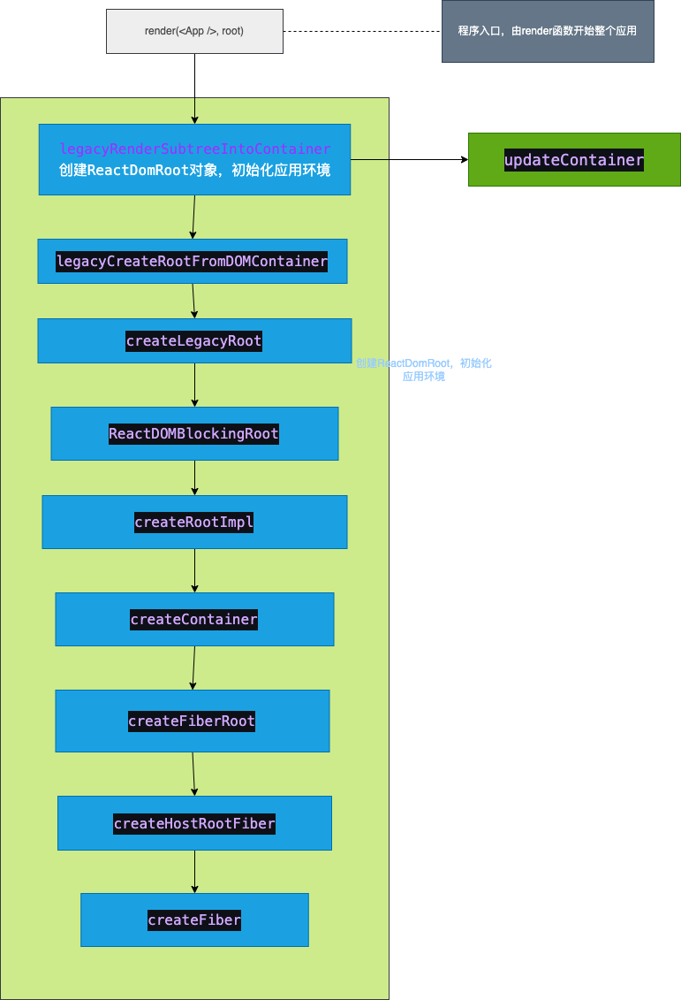

# 启动过程
一般应用的入口是`index.tsx`文件，以下语句启动一个react应用,分别对应3种模式：
```js
// legacy
ReactDOM.render(
  <App />,
  document.getElementById('root') as HTMLElement
);


// Blocking
// 1. 创建ReactDOMRoot对象
const reactDOMBlockingRoot = ReactDOM.createBlockingRoot(
  document.getElementById('root'),
);
// 2. 调用render
reactDOMBlockingRoot.render(<App />); // 不支持回调


// ConcurrentRoot
// 1. 创建ReactDOMRoot对象
const reactDOMRoot = ReactDOM.createRoot(document.getElementById('root'));
// 2. 调用render
reactDOMRoot.render(<App />); // 不支持回调
```

## 总体流程
在详细的过程之前，先看一看总体的流程



## 创建全局对象
无论`Legacy`, `Concurrent`或`Blocking`模式, react 在初始化时, 都会创建 3 个全局对象:
- ReactDom(Blocking)Root
  - 属于`react-dom`包，该对象有`render，unmount`方法，通过`render`方法启动应用
- fiberRoot
  - 属于`react-reconciler`包, 作为`react-reconciler`在运行过程中的全局上下文, 保存 fiber 构建过程中所依赖的全局状态
  - 其大部分实例变量用来存储fiber 构造循环过程的各种状态.react 应用内部, 可以根据这些实例变量的值, 控制执行逻辑.
- HostRootFiber
  - 属于`react-reconciler`包, 这是 react 应用中的第一个 Fiber 对象, 是 Fiber 树的根节点, 节点的类型是HostRoot

这3个对象间的关系：
```js
export function createFiberRoot(
  containerInfo: any,
  tag: RootTag,
  hydrate: boolean,
  hydrationCallbacks: null | SuspenseHydrationCallbacks,
): FiberRoot {
  const root: FiberRoot = (new FiberRootNode(containerInfo, tag, hydrate): any);
  if (enableSuspenseCallback) {
    root.hydrationCallbacks = hydrationCallbacks;
  }

  const uninitializedFiber = createHostRootFiber(tag);
  root.current = uninitializedFiber;
  uninitializedFiber.stateNode = root;

  initializeUpdateQueue(uninitializedFiber);

  return root;
}
```

从`createFiberRoot`的定义可见:
`FiberRootNode`的`current`属性指向`HostRootFiber`
`HostRootFiber`的`stateNode`指向`FiberRootNode`
最后，`ReactDom(Blocking)Root`的`_internalRoot`指向`FiberRootNode`


### legacy模式
#### render
```js
export function render(
  element: React$Element<any>,
  container: Container,
  callback: ?Function,
) {

  // render调用该方法
  return legacyRenderSubtreeIntoContainer(
    null,
    element,
    container,
    false,
    callback,
  );
}
```
#### legacyRenderSubtreeIntoContainer
```js
function legacyRenderSubtreeIntoContainer(
  parentComponent: ?React$Component<any, any>,
  children: ReactNodeList,
  container: Container,  // div#root
  forceHydrate: boolean,  // false
  callback: ?Function,
) {
  let root: RootType = (container._reactRootContainer: any);
  let fiberRoot;
  if (!root) {
    // 初次调用, root还未初始化, 会进入此分支
    //1. 创建ReactDOMRoot对象, 初始化react应用环境
    root = container._reactRootContainer = legacyCreateRootFromDOMContainer(
      container,  // div#root
      forceHydrate, // false
    );
    fiberRoot = root._internalRoot;
    if (typeof callback === 'function') {
      const originalCallback = callback;
      callback = function() {
        // instance最终指向 children(入参: 如<App/>)生成的dom节点
        const instance = getPublicRootInstance(fiberRoot);
        originalCallback.call(instance);
      };
    }
    // Initial mount should not be batched.
    unbatchedUpdates(() => {
      updateContainer(children, fiberRoot, parentComponent, callback);
    });
  } else {
    fiberRoot = root._internalRoot;
    if (typeof callback === 'function') {
      const originalCallback = callback;
      callback = function() {
        const instance = getPublicRootInstance(fiberRoot);
        originalCallback.call(instance);
      };
    }
    // Update
    updateContainer(children, fiberRoot, parentComponent, callback);
  }
  return getPublicRootInstance(fiberRoot);
}
```
#### legacyCreateRootFromDOMContainer
```js
function legacyCreateRootFromDOMContainer(
  container: Container,  // div#root
  forceHydrate: boolean,  // false
): RootType {
  const shouldHydrate = forceHydrate || shouldHydrateDueToLegacyHeuristic(container);

  // 清空div#root的子元素
  if (!shouldHydrate) {
    let warned = false;
    let rootSibling;
    while ((rootSibling = container.lastChild)) {
      container.removeChild(rootSibling);
    }
  }

  return createLegacyRoot(
    container,   // div#root
    shouldHydrate  // false
      ? {
          hydrate: true,
        }
      : undefined,
  );
}
```

#### createLegacyRoot
```js
export function createLegacyRoot(
  container: Container,  // div#root
  options?: RootOptions, // undefined
): RootType {
  return new ReactDOMBlockingRoot(container, LegacyRoot /* 0 */, options);
}
```
到此，已经创建了`ReactDOMBlockingRoot`


#### ReactDOMBlockingRoot
```js
function ReactDOMBlockingRoot(
  container: Container,
  tag: RootTag,
  options: void | RootOptions,
) {
  this._internalRoot = createRootImpl(container, tag, options);
}
```

```js
function createRootImpl(
  container: Container,
  tag: RootTag,
  options: void | RootOptions,
) {
  // ...
  // 1. 创建fiberRoot
  const root = createContainer(container, tag, hydrate /* false */, hydrationCallbacks);
  // 2. 标记dom对象, 把dom和fiber对象关联起来
  markContainerAsRoot(root.current, container);
  // ...

  return root;
}
```

#### createContainer
```js
export function createContainer(
  containerInfo: Container,
  tag: RootTag,
  hydrate: boolean,
  hydrationCallbacks: null | SuspenseHydrationCallbacks,
): OpaqueRoot {
  // 创建fiberRoot对象
  return createFiberRoot(containerInfo, tag, hydrate, hydrationCallbacks);
}
```

```js
export function createFiberRoot(
  containerInfo: any,
  tag: RootTag,
  hydrate: boolean,
  hydrationCallbacks: null | SuspenseHydrationCallbacks,
): FiberRoot {
  // 创建fiberRoot对象, 注意RootTag的传递
  const root: FiberRoot = (new FiberRootNode(containerInfo, tag, hydrate): any);
  if (enableSuspenseCallback) {
    root.hydrationCallbacks = hydrationCallbacks;
  }

  // 1. 这里创建了`react`应用的首个`fiber`对象, 称为`HostRootFiber`
  const uninitializedFiber = createHostRootFiber(tag /* 0 */);
  root.current = uninitializedFiber;
  uninitializedFiber.stateNode = root;

// 2. 初始化HostRootFiber的updateQueue
  initializeUpdateQueue(uninitializedFiber);

  return root;
}
```


#### createHostRootFiber
```js
export function createHostRootFiber(tag: RootTag): Fiber {
  let mode;
  if (tag === ConcurrentRoot) {
    mode = ConcurrentMode | BlockingMode | StrictMode;
  } else if (tag === BlockingRoot) {
    mode = BlockingMode | StrictMode;
  } else {
    mode = NoMode;
  }

  return createFiber(HostRoot, null, null, mode);
}
```

## 开始更新
在对象初始化和环境初始化结束后，会调用`updateContainer`来开始更新
```js
updateContainer(children /* App */, fiberRoot, parentComponent, callback);
```

```js
export function updateContainer(
  element: ReactNodeList,
  container: OpaqueRoot,
  parentComponent: ?React$Component<any, any>,
  callback: ?Function,
): Lane {

  const current = container.current;
  const eventTime = requestEventTime();

  const lane = requestUpdateLane(current);

  if (enableSchedulingProfiler) {
    markRenderScheduled(lane);
  }

  const context = getContextForSubtree(parentComponent);
  if (container.context === null) {
    container.context = context;
  } else {
    container.pendingContext = context;
  }

  const update = createUpdate(eventTime, lane);

  update.payload = {element};

  callback = callback === undefined ? null : callback;
  if (callback !== null) {
    update.callback = callback;
  }

  enqueueUpdate(current, update);
  scheduleUpdateOnFiber(current, lane, eventTime);

  return lane;
}
```