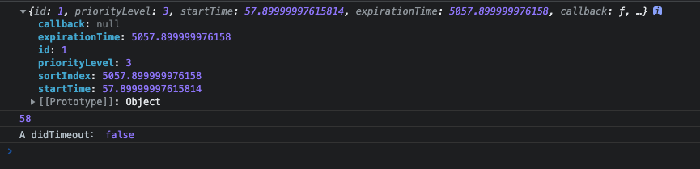

# scheduler

## 简介
`Scheduler` 是 `React` 提供的调度器，它内部暴露`unstable_scheduleCallback(priorityLevel, callback, options)`方法给我们调度任务，其中`priorityLevel`是调度的优先级，`callback` 是我们的任务，`optoins` 里面可以通过指定`delay`延迟执行我们的任务。`Scheduler` 支持任务按优先级排序执行，优先级通过过期时间体现，比如 `ImmediatePriority` 对应的过期时间是 `-1`毫秒，需要立即执行。

```js
var ImmediatePriority = 1; // 对应的过期时间：IMMEDIATE_PRIORITY_TIMEOUT -1毫秒 立即执行
var UserBlockingPriority = 2; // 对应的过期时间：USER_BLOCKING_PRIORITY_TIMEOUT 250毫秒 后过期
var NormalPriority = 3; // 对应的过期时间：NORMAL_PRIORITY_TIMEOUT 5000毫秒 后过期
var LowPriority = 4; // 对应的过期时间：LOW_PRIORITY_TIMEOUT 10000毫秒 后过期
var IdlePriority = 5; // 对应的过期时间：IDLE_PRIORITY_TIMEOUT maxSigned31BitInt永不过期
```

`unstable_scheduleCallback`返回一个 `task` 对象，用于描述任务的基本信息:
```js
export interface CallbackNode {
  callback: FrameCallbackType;
  priorityLevel: number;
  expirationTime: number;
  next: CallbackNode | null;
  prev: CallbackNode | null;
  startTime: startTime,
  sortIndex
}
```
`startTime` 是当前调用`unstable_scheduleCallback的时间 + options.delay(如果有指定的话)`，即
```js
startTime = performance.now() + options.delay;
```
`expirationTime`是`startTime + timeout`计算出来的，不同优先级 `timeout` 不同，如果优先级是 `UserBlockingPriority`，则 `timeout` 为 250 毫秒，那么 `expirationTime` 计算如下
```js
var expirationTime = startTime + 250;
```
对于`sortIndex`，是用于在队列中排序的，这里需要区分 `task` 的两种类型：
- 普通任务，不需要延迟执行，加入队列后就直接开始调度执行，这种任务存储在 `taskQueue` 中，同时按照 `expirationTime` 排序，`expirationTime` 最小的优先级最高，最先执行
- 延迟任务，需要延迟执行，加入队列后需要在指定的 `delay` 才开始调度执行，这种任务存储在 `timerQueue` 中，同时按照 `startTime` 排序，`startTime` 最小的需要最先调度执行

因此，对于延迟任务，`sortIndex`存的就是`startTime`。对于普通任务，`sortIndex`存的就是`expirationTime`

## 用法
### 相同优先级
```js
unstable_scheduleCallback(NormalPriority, printA)
unstable_scheduleCallback(NormalPriority, printB)
unstable_scheduleCallback(NormalPriority, printC)
unstable_scheduleCallback(NormalPriority, printD)
unstable_scheduleCallback(NormalPriority, printE)

// A didTimeout： false
// B didTimeout： false
// C didTimeout： false
// D didTimeout： false
// E didTimeout： false
```


可以看到几个`print`函数的执行顺序

### 取消某个任务
可以通过 `unstable_cancelCallback` 取消某个任务，`unstable_cancelCallback`通过重置`task.callback = null`即可取消任务
```js
const callbackA = unstable_scheduleCallback(NormalPriority, printA);
unstable_scheduleCallback(NormalPriority, printB);
unstable_scheduleCallback(NormalPriority, printC);
unstable_scheduleCallback(NormalPriority, printD);
unstable_scheduleCallback(NormalPriority, printE);
unstable_cancelCallback(callbackA);
```
控制台只输出了`B C D E`

### 不同优先级的任务，高优先级先执行
```js
unstable_scheduleCallback(IdlePriority, printA);
unstable_scheduleCallback(LowPriority, printB);
unstable_scheduleCallback(NormalPriority, printC);
unstable_scheduleCallback(UserBlockingPriority, printD);
unstable_scheduleCallback(ImmediatePriority, printE);
```

输出了`E D C B A`
由于`ImmediatePriority`对应的过期时间是`-1毫秒`，因此 `printE` 任务是立即过期的，所以输出的 `didTimeout` 为 `true`

### 任务超时
任务超时是指从任务开始加入队列到执行的这段时间是否超过了任务的优先级对应的超时时间 `timeout`。
比如当我们调用`unstable_scheduleCallback(UserBlockingPriority, printB)`时，`UserBlockingPriority`对应的超时时间为 `250 毫秒`。从调用 `unstable_scheduleCallback` 将 `printB` 加入队列，到 `printB` 执行的这段时间，如果超过了 `250 毫秒`，那么 `printB` 就超时了。否则就没有超时
```js
function printA(didTimeout) {
  const start = new Date().getTime()
  while (new Date().getTime() - start < 100) { }
  console.log("A didTimeout：", didTimeout)
}
const taskA = unstable_scheduleCallback(NormalPriority, printA)
const currentTime = performance.now()
console.log(taskA)
console.log(currentTime)
const start = new Date().getTime()
while (new Date().getTime() - start < 4999) { }
```
`NormalPriority`对应的超时时间是`5000ms`,主线程阻塞了`4999ms`，此时输出如下


如果主线程阻塞时间超过`5000ms`,输出：


### 任务切片
`scheduler` 在每一次事件循环中处理任务，每执行完一个 `task`，都需要判断当前事件执行时间是否超过 `5 毫秒`。如果超过 `5 毫秒`，则主动让出控制权，剩下的 `task` 在下一次时间循环中处理。如果没超过 `5 毫秒`，则继续执行下一个 `task`。也就是说，每一次事件循环执行的任务都不应超过 `5ms`。对于某个超长的 `task`，我们可以将其拆分成一小段执行

```js
const tasks = [
  ["C1", 4],
  ["C2", 6],
  ["C3", 7],
];
const printF = () => {
  while (tasks.length > 0) {
    const [label, ms] = tasks.shift();
    const start = new Date().getTime();
    while (new Date().getTime() - start < ms) {}
    console.log(label);
  }
};

unstable_scheduleCallback(NormalPriority, printF);
```
对于任务`F`，其执行时间为`4 + 6 + 7 = 17ms`,


我们可以将这个任务拆分成几小段执行，任务切片的原理如下：
- 首先将某个长任务 `task` 拆分成几小段，这需要一个合理的数据结构设计
- 通过 `Scheduler` 暴露的`unstable_shouldYield`判断当前执行时间是否超过了 `5 毫秒`，如果超过了就不继续执行下一小段任务
- 通过在 `callback` 中返回一个函数告诉 `Scheduler` 需要继续执行这个 `task`

```js
const tasks = [
  ["C1", 4],
  ["C2", 6],
  ["C3", 7],
];
const printG = () => {
  while (tasks.length > 0) {
    const [label, ms] = tasks.shift();
    const start = new Date().getTime();
    while (new Date().getTime() - start < ms) {}
    console.log(label);
    if (unstable_shouldYield()) {
      // 判断是否需要让出控制权
      console.log("yield：交出控制权");
      didYield = true;
      return printG; // 返回一个函数
    }
  }
};

unstable_scheduleCallback(NormalPriority, printG);
```

控制台输出：
```js
C1
C2
yield：交出控制权
C3
yield：交出控制权
```


# 参考
[React scheduler学习笔记](https://juejin.cn/post/7044820973043843080)
[五千字长文，解密 React Scheduler 如何运行](https://juejin.cn/post/7067492402868518949)
[【React Scheduler源码第二篇】React Scheduler用法详解](https://juejin.cn/post/7139884500699480077)
[100行代码实现React核心调度功能](https://zhuanlan.zhihu.com/p/446006183)